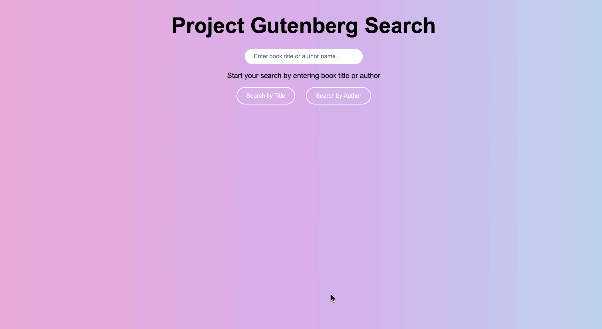

# Project Gutenberg Open Books Search Engine

## About The Project

This project is the final project of the Brown CSCI-1380 Distributed System course. Our team built a distributed search engine capable of searching over 28,200 open books in Project Gutenberg by either title or author. We leveraged MapReduce for several tasks including crawling and indexing and implemented distributed storage to enhance scalability.

Once deployed, our search engine will be accessible via a URL.

## Getting Started

### Prerequisites

1. Download the JavaScript runtime [Node.js](https://nodejs.org/).
2. Download the latest package manager npm: in your terminal, type `npm install npm@latest -g`

### Installation

1. Clone this repository
2. Run `npm install` from the project root to install all the project dependencies

### Start the App
Note that starting the project for the first time involves some preprocessing of the data, which is a one-time requirement.

1. Run `node workflow/crawler.js` to crawl the available books on Project Gutenberg. This might take a couple of minutes. You can always change the URL in the dataset section in this file to adjust the size of the books to be crawled.
2. Run `node workflow/index.js` to create appropriate data structures for efficiently answering queries. (Spoiler Alert: We used TF-IDF metrics for information retrieval.)
3. Run `node workflow/generateDict.js` to generate a dictionary for later spell-checking during searches.
4. Run `node workflow/server.js` to start the Express server.
5. Now you are all set! Open `http://localhost:3000/` in your browser and start your search!
